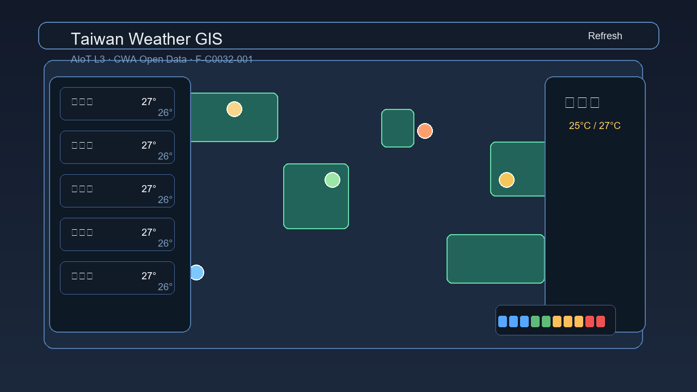

# 🌤 Taiwan Weather GIS

**AIoT L3 — CWA HW1**  
互動式台灣天氣 GIS 地圖，資料來源：[中央氣象署 CWA Open Data](https://opendata.cwa.gov.tw/)

[](https://www.python.org/)
[](https://flask.palletsprojects.com/)
[](https://leafletjs.com/)
[](https://opendata.cwa.gov.tw/)

## Live Demo

🌐 網站連結：<http://127.0.0.1:5000/>

<p align="center">
  
</p>

---

## 功能特色

- 🗺️ **Leaflet + OpenStreetMap** 互動地圖，台灣縣市 GeoJSON 邊界
- 🌡️ **溫度色彩地圖**：依最高溫自動著色（藍 → 橘 → 紅）
- 📍 **22 縣市天氣標記**：即時 emoji + 氣溫顯示
- 📋 **左側縣市清單**：可搜尋、依溫度排序
- 🖱️ **點擊縣市** → 右側 36 小時詳細預報面板
- 🔄 **一鍵 Refresh**：重新呼叫 CWA API 並更新資料庫
- 💾 **SQLite 本地資料庫**：UPSERT 防重複策略

---

## 系統架構

```
Gate 1: CWA API (F-C0032-001)
    ↓
Gate 2: SQLite Database (ETL)
    ↓
Gate 3: Flask + Leaflet GIS Dashboard
    ↓
Gate 4: GitHub (this repo)
    ↓
Gate 5: Vercel Deployment
```

---

## 專案結構

```
0923/
├── app.py              # Flask server（API + 靜態資源）
├── database.py         # Gate 2：CWA ETL → SQLite
├── gate1_cwa_api.py    # Gate 1：CWA API 驗證腳本
├── download_geo.py     # 下載 Taiwan GeoJSON 工具
├── requirements.txt    # Python 相依套件
├── .gitignore          # 排除 .env / DB / cache
├── templates/
│   └── index.html      # Leaflet 互動 GIS Dashboard
└── static/
    └── taiwan.geojson  # 台灣縣市邊界 GeoJSON
```

---

## 快速開始

### 1. 安裝套件

```bash
pip install -r requirements.txt
```

### 2. 設定 API Key

複製 `.env.example` 為 `.env`，填入你的 CWA API Key：

```env
CWA_API_KEY=CWA-XXXXXXXX-XXXX-XXXX-XXXX-XXXXXXXXXXXX
```

> 至 [CWA Open Data](https://opendata.cwa.gov.tw/) 免費申請

### 3. 下載 GeoJSON（僅需執行一次）

```bash
python download_geo.py
```

### 4. 初始化資料庫（Gate 1 + Gate 2）

```bash
python gate1_cwa_api.py   # 驗證 CWA API
python database.py         # ETL → SQLite
```

### 5. 啟動 GIS Dashboard

```bash
python app.py
```

開啟瀏覽器：`http://localhost:5000`

---

## API Endpoints

| Method | Endpoint | 說明 |
|--------|----------|------|
| `GET` | `/` | GIS Dashboard 首頁 |
| `GET` | `/api/weather` | 全台 22 縣市天氣資料（JSON） |
| `POST` | `/api/weather/refresh` | 重新從 CWA API 抓取並更新 DB |

---

## 資料集

| 欄位 | 說明 |
|------|------|
| **Dataset** | F-C0032-001（今明 36 小時天氣預報） |
| **Endpoint** | `https://opendata.cwa.gov.tw/api/v1/rest/datastore/F-C0032-001` |
| **涵蓋地區** | 台灣 22 縣市 |
| **預報時段** | 每 6/12 小時一段，共 3 段 |
| **要素** | Wx（天氣）、MinT、MaxT、PoP（降雨機率） |

---

## 安全說明

- `.env`（含 API Key）已加入 `.gitignore`，**不會上傳至 GitHub**
- `weather.db`（本地 SQLite）已排除
- `cwa_sample.json`（原始 API 快取）已排除

---

## 技術棧

| 類別 | 技術 |
|------|------|
| 後端 | Python 3.11 + Flask 3.x |
| 前端 | Vanilla HTML/CSS/JS |
| 地圖 | Leaflet 1.9 + OpenStreetMap |
| GeoJSON | ronnywang/twgeojson（twcounty2010.2） |
| 資料庫 | SQLite 3（本地）|
| 資料來源 | 中央氣象署 CWA Open Data |

---

## License

MIT © 2026
